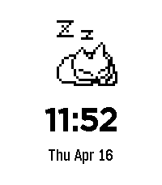

Neko, the iconic screenmate mascot from the 90s, now in your wrist!

An animated neko will play around in your watch. After a while, it will grow tired and go to sleep. It will wake up with a tap.

Pebble app store: https://apps.repebble.com/4c25df439af543d19c98630a

## Building

Install the [pebble sdk](https://developer.repebble.com/sdk/), then build and run on an emulator:

`pebble build && pebble install --emulator emery`

## Other

Mostly vibecoded using [the official claude skill for pebble](https://apps.repebble.com/4c25df439af543d19c98630a). 

Neko sprites sourced from http://ftp.slackware.com/pub/slackware/slackware64-current/source/xap/xgames/xneko.tar.lz 